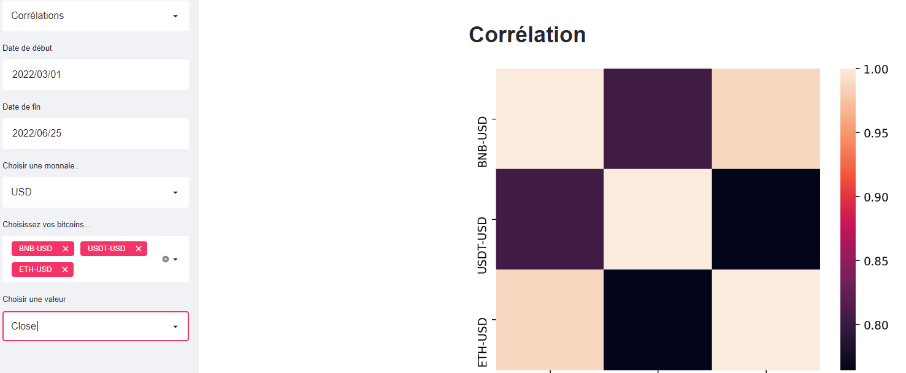
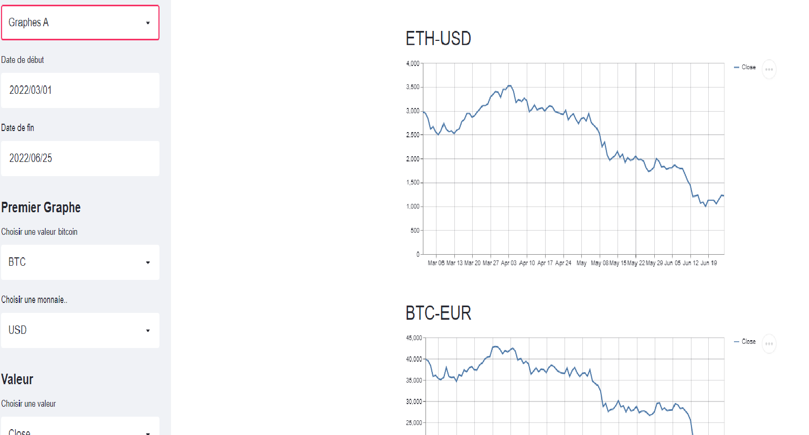

# Bitcoin_project


Nous avons créé une application permettant de suivre l'évolution des principaux bitcoins au jour le jour grâce à l'API yFinance et l'outil Streamlit. On peut aussi voir les corrélations entre les différentes valeurs.

## Installation

```
git clone https://github.com/lefatoum2/Bitcoin_project.git
cd Bitcoin_project
pip install -r requirements.txt
```

## Running 

```
streamlit run main.py
```

https://bitcoin1491.herokuapp.com/




